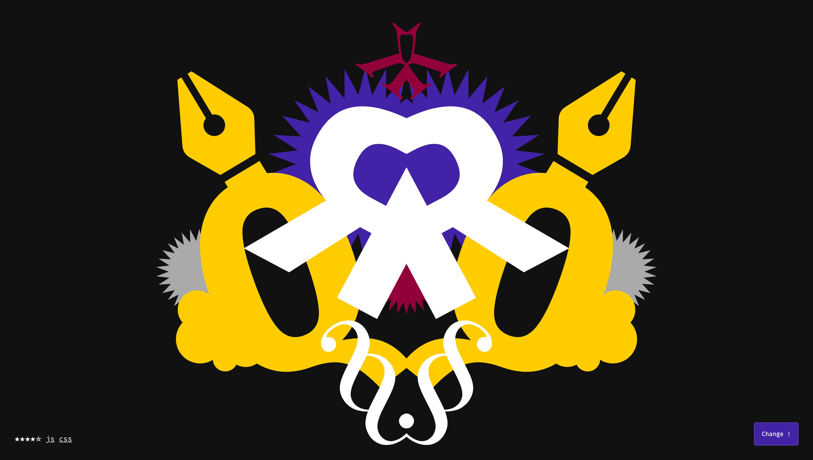

# Scroll-Color

## Résumé

Réaliser une courte expérience web mettant en scène une double gamme de 5 couleurs à 
travers des écrans que l'on fait défiler au "scroll". Un ultime bouton permet de 
redéfinir les 5 couleurs utilisées.

## Description détaillée

Une page web, sobre en première apparition, propose une navigation au "scroll" 
(verticale par défaut, horizontale si désirée). Le scroll met en scène une gamme 
de 5 couleurs à travers des compositions abstraites ou figurées, statique ou animées.
La variation des compositions, des registres graphiques et des animations des 
différents écrans créent un ensemble esthétique cohérent : c'est un exercice de 
style graphique et interactif. L'enchaînement des écrans doit être pensé pour tenter
de créer un rythme. Un effet crescendo doit être envisagé.

Arrivé en bas de page un bouton, discret ou non, permet de changer la gamme de 
couleur actuelle pour une nouvelle gamme. L'expérience des précédents écrans, lue
à rebours se retrouve alors renouvelée.

## Contraintes
- 5 écrans minimum (2 simple: "intro" + "color-set", 3 originaux)
- 2 gammes de couleurs (environ 5 valeurs par gamme).
- L'écran d'introduction comporte un titre, contient un élément invitant au scroll 
  (call-to-action: pictogramme, mot, courte phrase, animé ou non)
- L'écran "color-set" permet de retrouver le code hexadécimal de chaque couleur. 
  Un simple clic permet de copier le code couleur dans le presse-papier.
- 3 écrans "complexes" accompagnent au minimum les deux premiers écrans.
- Chaque écran a la même hauteur, à minima, que le fenètre (`100vh`).
- Le choix et l'usage des couleurs doivent apporter une cohérence graphique aux 
  différents écrans.
- L'utilisation des couleurs dans les différents écrans doit nécessairement faire 
  appel aux variables CSS (syntaxe: `var(--color-x)`)
  
## Demo
À des fins d'inspirations en css et js, une démo est disponible ici :
- [color-scroll-master](https://jniac.github.io/dimi-m2-fa-work-21-22/works/jniac/color-scroll-master/)

## Critères d'évaluations

L'évaluation se fait selon deux principaux critères, sur 10 points chacun : 
- Artistique / 10
- Technique / 10

Comme il est possible ici d'aborder l'exercice par de nombreux cotés. Il est 
demandé pour chaque rendu de préciser ce qui été investi en priorité. Il se 
trouve donc un système de 5 points à répartir entre 4 différentes catégories à
raison de 3 points maximum par catégorie : 
- ☑️☑️☑️ Design (composition, typographie, illustration)
- ☑️☑️☑️ Animation (css: transition / @keyframes, effets parallax)
- ☑️☑️☑️ Interaction (javascript, bouton, feedback, effets parallax avancés)
- ☑️☑️☑️ Procédural (javascript, programmation de composition + ou - aléatoires)
- ☑️☑️☑️ Responsive (intégration css, media queries)

## Informations utiles : 
[Les variables css](https://developer.mozilla.org/fr/docs/Web/CSS/Using_CSS_custom_properties) 
sont un puissant outil pour réaliser des chartes graphiques. Le recours aux 
variables permet de définir des teintes qui peuvent réutiliser partout (jusque 
dans d'éventuels éléments svg). Les variables css sont... variables ! En changeant
la valeur d'une variable c'est tout ou partie de la page qui est redessinée.

Au delà de la possibilité de redéfinir la gamme de couleurs, les variables css
sont, dans la page démo ([color-scroll-master](https://jniac.github.io/dimi-m2-fa-work-21-22/works/jniac/color-scroll-master/)),
largement utilisées pour créer des animations, ou plus simplement pour définir
des propriétés des design (taille d'un élément).
